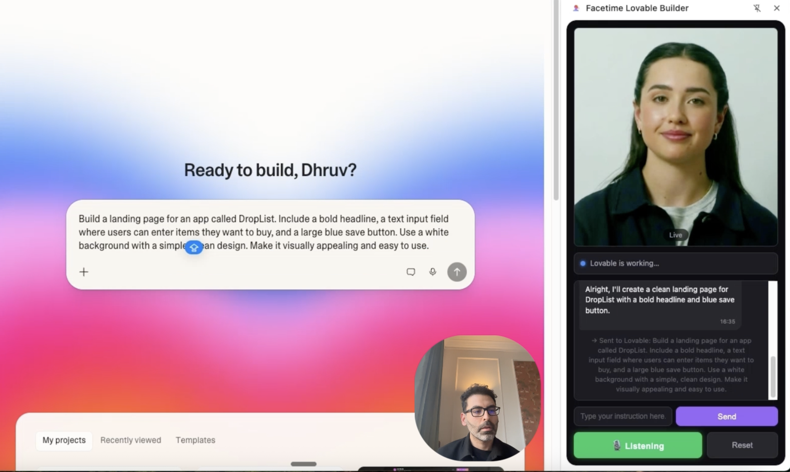

# 🎙️ Facetime Lovable Builder

> **Build web apps with your voice — powered by AI.**

A Chrome extension that lets you talk to an AI avatar to build apps on [Lovable.dev](https://lovable.dev). Speak a casual instruction, and the avatar reformulates it into an optimized prompt via Claude, injects it into Lovable's chat, and narrates Lovable's response back to you — hands-free.

<!-- 🖼️ HERO SCREENSHOT — Replace with a screenshot of the extension side panel with the avatar active -->
<!--  -->

---

## ✨ Features

| Feature | Description |
|---------|-------------|
| 🗣️ **Voice-Powered Building** | Speak naturally to an AI avatar — it captures your speech and drives Lovable for you |
| 🧠 **Intelligent Prompt Engineering** | Claude reformulates casual speech into optimized Lovable prompts |
| 🧹 **Response Summarization** | Raw DOM output is cleaned and summarized into natural conversational sentences |
| 🔄 **Auto-Recovery** | Detects build failures and automatically asks Lovable to diagnose and fix them |
| 🛑 **Voice Stop Command** | Say "stop" or "cancel" to immediately halt Lovable's current build |
| ⌨️ **Text Fallback** | Full functionality without a microphone — type instructions in the chat input |
| 🎭 **Avatar Optional** | Works in text-only mode when Anam credentials are unavailable |

---

## 🎬 Demo

<!-- 🎥 DEMO GIF — Replace with a GIF or video showing the full voice pipeline in action -->
<!--  -->

*Coming soon — a recorded demo of the full voice pipeline with avatar.*

---

## 🏗️ How It Works

```
  You speak (or type)
       ↓
  Anam.ai avatar captures speech          ← Side Panel
       ↓
  Service worker sends to Claude API       ← Background
       ↓
  Claude reformulates → Lovable prompt
       ↓
  Content script injects into Lovable      ← lovable.dev tab
       ↓
  MutationObserver captures response
       ↓
  Claude summarizes the raw response
       ↓
  Avatar narrates clean summary back       ← Side Panel
```

### 🧩 Component Map

| Component | File | Role |
|-----------|------|------|
| **Side Panel** | `sidepanel/` | Avatar video, chat UI, text input, status bar |
| **Service Worker** | `background/service-worker.js` | Message router, Claude API client, conversation history |
| **Content Script** | `content/content-script.js` | DOM injection, response capture, build state detection |
| **Anam SDK** | `sidepanel/anam-sdk.js` | Avatar rendering, lip-sync, TTS (bundled locally for MV3) |
| **Config** | `config.js` | API keys and behavior settings (gitignored) |

---

## 📋 Prerequisites

| Requirement | Notes |
|-------------|-------|
| **Google Chrome** | v114+ (Manifest V3 support) |
| **[Anam.ai](https://lab.anam.ai/)** account | Free tier available — provides avatar + voice |
| **[Anthropic](https://console.anthropic.com/)** account | Claude API key for prompt engineering |
| **[Lovable.dev](https://lovable.dev)** project | Must be open in Chrome when using the extension |

---

## 🚀 Quick Start

### 1. Clone the repo

```bash
git clone https://github.com/dhruv-builds/lovable-avatar-builder.git
cd lovable-avatar-builder
```

### 2. Configure API keys

**Option A — Edit directly (simplest)**

```bash
cp config.example.js config.js
```

Open `config.js` and fill in your values:

```javascript
const CONFIG = {
  ANAM_API_KEY: 'your-anam-api-key',
  ANAM_AVATAR_ID: 'your-avatar-id',
  ANAM_VOICE_ID: 'your-voice-id',
  ANTHROPIC_API_KEY: 'your-anthropic-key',
  // ...
};
```

**Option B — Use .env (recommended)**

```bash
cp .env.example .env
# Edit .env with your values, then:
chmod +x generate-config.sh
./generate-config.sh
```

> 🔒 Both `config.js` and `.env` are gitignored — your keys will never be committed.

### 3. Load the extension

1. Open Chrome → `chrome://extensions`
2. Enable **Developer Mode** (toggle, top-right)
3. Click **Load unpacked** → select this project folder

### 4. Start building

1. Open a project on [lovable.dev](https://lovable.dev)
2. Click the **Facetime Lovable Builder** icon in Chrome's toolbar
3. The side panel opens — wait for "Listening" status
4. Speak your instruction (or type it in the text input)
5. Watch Lovable build — the avatar narrates the result

---

## 🔑 Getting API Keys

### Anam.ai (Avatar + Voice)

1. Sign up at [lab.anam.ai](https://lab.anam.ai/)
2. Go to **API Keys** → copy your key
3. Go to **Avatars** → pick one → copy its ID
4. Go to **Voices** → pick one → copy its ID

```bash
# List available voices via API
curl https://api.anam.ai/v1/voices -H "Authorization: Bearer YOUR_ANAM_API_KEY"
```

### Anthropic (Claude)

1. Sign up at [console.anthropic.com](https://console.anthropic.com/)
2. Go to **API Keys** → create a new key → copy it

---

## 🗂️ File Structure

```
facetime-lovable-builder/
├── manifest.json              # Chrome Extension Manifest V3
├── config.example.js          # Config template — copy to config.js
├── .env.example               # Environment variable template
├── generate-config.sh         # Generates config.js from .env
├── LICENSE                    # MIT License
│
├── background/
│   └── service-worker.js      # Message routing + Claude API integration
│
├── sidepanel/
│   ├── sidepanel.html         # Side panel UI layout
│   ├── sidepanel.css          # Dark theme styles
│   ├── sidepanel.js           # Anam SDK init, speech handling, chat UI
│   └── anam-sdk.js            # Anam SDK v4 (bundled locally for MV3 CSP)
│
├── content/
│   └── content-script.js      # DOM injection + response capture on lovable.dev
│
└── icons/
    ├── icon16.png
    ├── icon48.png
    └── icon128.png
```

---

## 🎯 Controls

| Control | Action |
|---------|--------|
| **Text input + Send** | Type an instruction manually |
| **Reset** | Clear conversation history and start fresh |
| **Voice "stop"** | Say "stop", "cancel", or "halt" to stop Lovable's current build |

> 💡 **Tip:** The extension works without a microphone — use the text input as your primary interface if voice isn't available.

---

## 🐛 Troubleshooting

### Avatar won't connect
- Check Console (right-click side panel → **Inspect**) for errors
- Verify `ANAM_API_KEY` is correct in `config.js`
- Confirm your Anam account has available minutes at [lab.anam.ai](https://lab.anam.ai/)

### Prompts not injected into Lovable
Lovable's DOM selectors may have changed. Inspect `lovable.dev` in DevTools and update the `SELECTORS` object in [content-script.js](content/content-script.js).

### "No Lovable tab found"
Make sure a `lovable.dev` tab is open **in the same Chrome window** before using the extension.

### Claude API errors
Open the service worker console: `chrome://extensions` → click the **"Service Worker"** link under the extension → check for error messages.

### Extension changes not taking effect
After editing code, go to `chrome://extensions` → click the **reload** ↻ icon on the extension.

### Wrong avatar voice
Change `ANAM_VOICE_ID` in `config.js`:
```bash
curl https://api.anam.ai/v1/voices -H "Authorization: Bearer YOUR_ANAM_API_KEY"
```

---

## 🔒 Security

- `config.js` and `.env` are **gitignored** — your API keys are never committed
- The Anam SDK is **bundled locally** (`sidepanel/anam-sdk.js`) — no remote script loading (required by Chrome MV3 CSP)
- Claude API calls use the `anthropic-dangerous-direct-browser-access` header — acceptable for personal use

**For production / team use:**
- Proxy Anthropic API calls through your own backend
- Generate Anam session tokens server-side

---

## 🛠️ Development

### Mock Mode

Test the full UI without API keys:

```javascript
// In config.js
MOCK_MODE: true,   // Bypasses API calls with canned responses
DEBUG_LOG: true     // Shows debug panel in side panel
```

### Architecture Notes

- **Chrome Manifest V3** — no remote scripts, service worker instead of background page
- **No build step** — pure vanilla JS, loads directly in Chrome
- **Anam SDK v4** — uses `createClient(sessionToken)` production flow with `llmId: 'CUSTOMER_CLIENT_V1'` (bring-your-own-intelligence mode)
- **React compatibility** — content script uses native property setters + synthetic event dispatch to bypass React's synthetic event system
- **TipTap injection** — synthetic paste events for ProseMirror-based editors

---

## 🤝 Contributing

1. Fork the repo
2. Configure: `cp config.example.js config.js` and fill in your keys
3. Load the extension in Chrome (Developer Mode → Load unpacked)
4. Make changes → reload extension at `chrome://extensions` → test on lovable.dev
5. Open a PR

---

## 📄 License

[MIT](LICENSE) — Dhruv Sondhi
